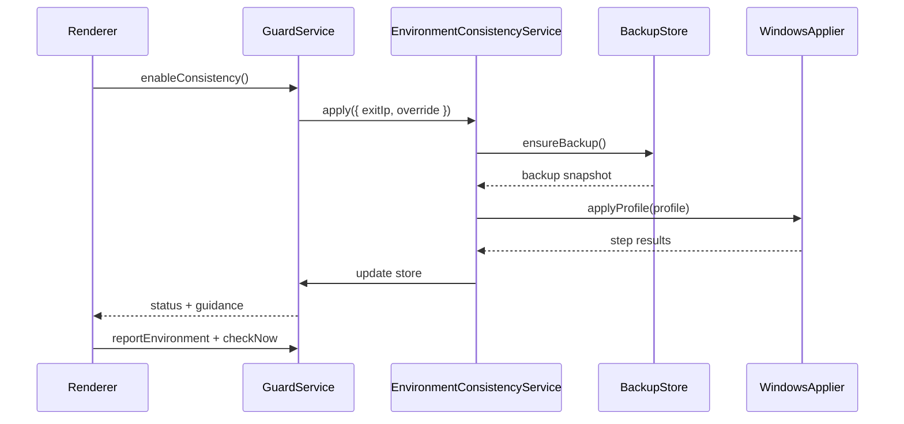

# Environment Consistency One-Click Fix Design

## Goal

Add a **one-click environment consistency fix** that aligns Windows system settings and external browsers (Chrome, Edge) with the current exit IP posture. Users can **toggle** between aligned and original environments, with **automatic backup and restore** of all modified settings.

## Background

`ENVIRONMENT_MISMATCH` blocks guarded traffic when any of the following fail:

| Signal | Source | Current block rule |
|--------|--------|-------------------|
| Time zone | Electron `Intl` | Blocked CN/HK/MO IANA zones |
| Language | Electron `navigator` | Blocked `zh-CN`, `zh-HK`, `zh-MO` in primary or `languages` list |
| WebRTC local IPs | Electron WebRTC probe | Block if RFC1918 count > 0 |

Users on mainland Windows with a US VPN exit consistently fail language and WebRTC checks. Manual fixes are error-prone (wrong target, browser extensions do not affect Electron, cached environment on re-check).

Existing patterns to follow:

- `emergencyRestore()` in `guard-service.js`: step-based execution, partial failure reporting, persisted result in store.
- `reason-catalog.js` guidance actions wired through `runGuidanceAction()` in `renderer.js`.
- Local-only state in `store.js` under `%APPDATA%\claude-network-guard\`.

## Product Principles

1. **Reversible by default**: never apply alignment without a retrievable backup.
2. **Explicit toggle**: users choose aligned vs original; disabling alignment restores backup.
3. **Exit-IP-driven defaults**: target profile derives from latest check's `countryCode` / `regionName`, with optional user override.
4. **Fail clearly**: report per-layer success (Windows, Chrome, Edge, app) like emergency restore.
5. **Safe scope**: only modify settings this feature owns; never touch unrelated registry keys or full browser profiles.

## Target Profile Resolution

### Auto derivation (default)

New module `environment-profile-resolver.js` maps provider check output to a target profile:

```javascript
{
  timeZone: 'America/Chicago',      // IANA ID used by environment checker
  windowsTimeZone: 'Central Standard Time', // Windows tzutil / Set-TimeZone ID
  language: 'en-US',
  languages: ['en-US'],
  countryCode: 'US'
}
```

Resolution order:

1. User override fields in store (`profileOverride.timeZone`, `profileOverride.language`) if set.
2. Region-aware mapping when `regionName` matches a known US state / EU country subregion table.
3. Country fallback table (minimum viable set for v1):

| countryCode | Default IANA | Default language |
|-------------|--------------|------------------|
| US | America/New_York | en-US |
| GB | Europe/London | en-GB |
| CA | America/Toronto | en-CA |
| AU | Australia/Sydney | en-AU |
| DE | Europe/Berlin | de-DE |
| JP | Asia/Tokyo | ja-JP |
| *(unknown)* | America/New_York | en-US |

4. If country is in blocked region set (CN, HK, MO), alignment still applies a **non-blocked** profile derived from nearest allowed neighbor or user override; show warning that exit IP and environment target conflict.

US region refinement (**required in v1**, match on `regionName` case-insensitive substring):

| Match keywords / states | IANA | Windows ID |
|-------------------------|------|------------|
| `Alabama`, `Arkansas`, `Illinois`, `Iowa`, `Louisiana`, `Minnesota`, `Mississippi`, `Missouri`, `Oklahoma`, `Texas`, `Wisconsin`, `Kansas`, `Nebraska`, `North Dakota`, `South Dakota`, `Central` | America/Chicago | Central Standard Time |
| `California`, `Washington`, `Oregon`, `Nevada`, `Pacific`, `Arizona` (no DST: still map to Pacific for env check) | America/Los_Angeles | Pacific Standard Time |
| `Colorado`, `Montana`, `Utah`, `Wyoming`, `New Mexico`, `Idaho`, `Mountain` | America/Denver | Mountain Standard Time |
| `Indiana`, `Georgia`, `Florida`, `New York`, `Ohio`, `Pennsylvania`, `Michigan`, `North Carolina`, `Virginia`, `Eastern` | America/New_York | Eastern Standard Time |
| `Alaska` | America/Anchorage | Alaskan Standard Time |
| `Hawaii` | Pacific/Honolulu | Hawaiian Standard Time |
| default US (no state match) | America/New_York | Eastern Standard Time |

### User override (optional)

Settings panel fields (persisted in store):

```javascript
environmentConsistency: {
  deriveFromExitIp: true,           // default true
  profileOverride: {
    timeZone: '',                   // empty = use derived
    language: '',                   // empty = use derived
    languages: []                   // empty = use derived
  }
}
```

Override applies on next enable/apply; changing override while enabled re-applies only the delta layers (timezone and/or language).

## Backup & Restore

### Backup file

Path: `{dataDir}/environment-backup.json`

Created **once** before the first apply (or refreshed if user explicitly chooses "重新备份当前环境"). Structure:

```javascript
{
  version: 1,
  createdAt: 'ISO-8601',
  platform: 'win32',
  windows: {
    timeZoneId: 'China Standard Time',
    userLanguages: [{ LanguageId: 'zh-Hans', ... }],
    localeName: 'zh-CN',
    geoLocation: null
  },
  chrome: {
    installed: true,
    preferencesPath: '...',
    intlAcceptLanguages: 'zh-CN,zh',
    webrtcPolicy: null            // null = no policy key present
  },
  edge: {
    installed: true,
    preferencesPath: '...',
    intlAcceptLanguages: 'zh-CN,zh',
    webrtcPolicy: null
  }
}
```

Backup captures only fields this feature modifies. Full browser `Preferences` files are **not** copied wholesale.

### Restore behavior

When user toggles **off** consistency mode or clicks **还原原始环境**:

1. Load `environment-backup.json`; fail with clear error if missing.
2. Restore Windows time zone and user language list.
3. Restore Chrome/Edge `intl.accept_languages` and remove WebRTC policy keys this app added.
4. Set `environmentConsistency.enabled = false`.
5. Append log entry; emit event for UI refresh.

Restore is idempotent and safe to run repeatedly.

## Apply Behavior (Consistency ON)

Orchestrator: `environment-consistency-service.js`, invoked from `GuardService`.

### Pre-flight

1. Require a recent `lastCheck` with valid `ip.countryCode` unless user override fully specifies profile.
2. Detect running Chrome/Edge processes; if running, return `BROWSER_RUNNING` step failure with instruction to close browsers and retry (do not corrupt open profiles).
3. Create backup if none exists.

### Apply steps (Windows v1)

| Step | Action | Requires admin |
|------|--------|----------------|
| `windows.timezone` | `Set-TimeZone -Id <windowsTimeZone>` or `tzutil /s` | No |
| `windows.language` | `Set-WinUserLanguageList` with target language first, remove blocked langs | No |
| `windows.locale` | Set regional format to match language (best effort) | No |
| `chrome.language` | Patch `Default/Preferences` → `intl.accept_languages` | No |
| `chrome.webrtc` | HKCU policy `WebRtcIPHandlingPolicy = disable_non_proxied_udp` | No |
| `edge.language` | Patch Edge `Default/Preferences` | No |
| `edge.webrtc` | HKCU policy `WebRtcIPHandlingPolicy = disable_non_proxied_udp` | No |
| `app.webrtc` | Already handled via Electron launch flag in `main.js` | N/A |

### Post-apply

1. Set `environmentConsistency.enabled = true`.
2. Store `lastApplyResult` with per-step status.
3. **Immediately restart Network Guard** so Electron picks up `--lang` and WebRTC launch flags (required in v1, no optional deferral).
   - Main process sets `app.relaunch()` + `app.exit(0)` after persisting store and returning apply result to renderer, **or** IPC returns `{ restartRequired: true }` and renderer shows "正在重启应用以生效…" before quit.
   - On relaunch, auto-run `reportEnvironment()` + `checkNow()` once (store flag `environmentConsistency.pendingPostApplyCheck`).
4. If language step applied but post-restart check still shows blocked language, show **partial success** banner: "系统语言已修改，请注销 Windows 后重新检测。"

## Toggle UX

### Overview panel — new "环境一致性" block

Mirrors `binding-box` / `restore-box` pattern in `index.html`:

- **Toggle switch**: `环境一致性` ON/OFF
- **Status line**: derived target summary, e.g. `目标：America/Chicago / en-US（来自 US 出口）`
- **Backup line**: `已备份原始环境 · 2026-05-30 11:40` or `尚未备份`
- **Primary button**: `一键对齐环境` (when OFF and mismatch detected)
- **Secondary button**: `还原原始环境` (when ON or backup exists)
- **Result message** (`environmentConsistencyStatus`): success / partial / error, same tone classes as `recoveryStatus`

### Fix Guide integration

Update `ENVIRONMENT_MISMATCH` in `reason-catalog.js`:

```javascript
actions: [
  action('fix-environment', '一键修复环境', 'primary'),
  action('view-report', '查看环境详情'),
  action('retry-check', '重新检测')
]
```

Wire `fix-environment` in `runGuidanceAction()` → triggers apply flow (same as toggle ON).

### Settings override (overview side panel or new settings section)

- Checkbox: `跟随出口 IP 自动选择目标环境` (`deriveFromExitIp`)
- Inputs: `目标时区 (IANA)`, `目标语言` — disabled when derive checkbox checked unless "高级" expanded
- Button: `重新备份当前环境` (confirmation required)

## Architecture

```
GuardService
  └── EnvironmentConsistencyService
        ├── EnvironmentProfileResolver   (pure: IP/override → profile)
        ├── EnvironmentBackupStore     (read/write backup JSON)
        └── EnvironmentApplierWin      (PowerShell + JSON patch + registry)
```

Data flow:



## IPC Surface

| Channel | Purpose |
|---------|---------|
| `guard:environment-consistency-apply` | Apply alignment |
| `guard:environment-consistency-restore` | Restore from backup |
| `guard:environment-consistency-set-config` | Save override / deriveFromExitIp |
| `guard:environment-consistency-backup-now` | Force fresh backup |
| `guard:get-status` | Include `environmentConsistency` block |

Preload exposes matching `networkGuard.*` methods.

## Store Schema Extension

```javascript
environmentConsistency: {
  enabled: false,
  deriveFromExitIp: true,
  profileOverride: { timeZone: '', language: '', languages: [] },
  backup: { createdAt: null, path: null },
  lastTargetProfile: null,
  lastApplyResult: null,   // { ok, at, steps: { 'windows.timezone': { ok, error } } }
  lastRestoreResult: null
}
```

## Error Handling

| Condition | User-facing behavior |
|-----------|---------------------|
| Chrome/Edge running | Block apply; list which browsers to close |
| Backup write failed | Abort apply; no mutations |
| Partial step failure | Continue remaining steps; `ok: false` overall; list failed layers |
| No backup on restore | Error: "未找到备份，无法还原" |
| Unsupported platform | Disable feature; show "仅支持 Windows" |
| Exit IP unknown | Use override or country fallback; warn if guessing |

Never leave inconsistent state: if apply fails mid-way, store records which layers succeeded so restore can still revert them using backup (restore always sets absolute values from backup, not inverse deltas).

## Security & Privacy

- Backup stays local in app data directory.
- Diagnostic report includes **backup summary only** (see below), never full `environment-backup.json` contents.
- Browser preference paths are user-local; no network transmission.
- Registry writes limited to HKCU Chrome/Edge WebRTC policy keys with app marker comment in log.

## Platform Scope

| Platform | v1 |
|----------|-----|
| Windows 10/11 | Full support |
| macOS | Stub applier returns `UNSUPPORTED_PLATFORM`; UI hidden or disabled |

## Testing Strategy

| Module | Tests |
|--------|-------|
| `environment-profile-resolver.js` | US region mapping, override precedence, unknown country fallback |
| `environment-backup-store.js` | round-trip read/write, version migration |
| `environment-consistency-service.js` | apply calls applier steps; restore calls backup; toggle state |
| `environment-applier-win.js` | mock `child_process.execFile`; verify commands/patches |
| `reason-catalog.js` | `fix-environment` action present |
| `renderer-static.test.js` | new UI ids and IPC wiring |

Integration tests use temp data dir (`NETWORK_GUARD_DATA_DIR`) and fixture preference files.

## Acceptance Criteria

1. User can click **一键修复环境** when `ENVIRONMENT_MISMATCH` is present.
2. First apply creates `environment-backup.json` with pre-change Windows and browser settings.
3. Apply sets time zone, language, Chrome/Edge language + WebRTC policy to match derived or overridden profile.
4. Toggle OFF or **还原原始环境** restores backup values and sets `enabled: false`.
5. UI shows per-layer apply/restore result (mirrors emergency restore pattern).
6. User can override target time zone and language; auto-derive remains default.
7. `deriveFromExitIp: true` uses latest check `countryCode` / `regionName`.
8. Diagnostic report includes `environmentConsistency` block with: `enabled`, `deriveFromExitIp`, `lastTargetProfile`, `backup.createdAt`, `backup.hasBackup`, `lastApplyResult.ok`, `lastRestoreResult.ok` (not full backup file contents).
9. Feature disabled gracefully on non-Windows platforms.
10. All new modules have unit tests; existing test suite passes.

## Out of Scope (v1)

- Firefox / Safari browser support
- Automatic Windows sign-out or reboot
- Automatic browser restart
- macOS system locale APIs
- Modifying non-Chromium browsers
- Changing Electron UI language (guard UI stays Chinese)

## Open Questions (resolved)

| Question | Decision |
|----------|----------|
| Target profile source | Auto from exit IP + user override |
| US timezone mapping | **Subdivide by US state/region keywords** (table above) |
| Scope | System + Chrome + Edge |
| Reversibility | Backup file + explicit restore toggle |
| Browser running | Fail apply with close-browser instruction |
| App restart after apply | **Required immediately** (`relaunch` + post-restart auto check) |
| Diagnostic report backup info | **Yes** — include `backup.createdAt` summary |
